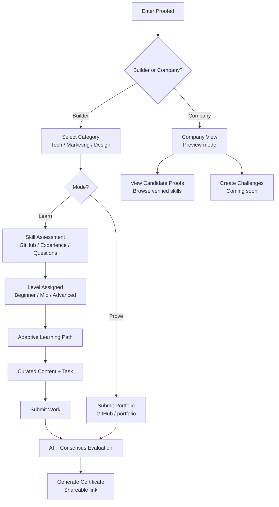

# ⬡ Proofed Protocol

> The verification layer for the Web3 talent economy.

---

## The Problem

In the age of AI, knowledge is no longer a reliable signal. Anyone can generate code, content, or answers instantly.
But we still lack a way to verify what someone can actually build.

Current systems rely on:
	•	degrees
	•	certificates
	•	resumes

But they don’t reflect real capability.

This creates a fundamental gap:

There is no reliable way to prove real skills through real work. This is not just a learning problem.
It is a verification problem for the future of work.

⸻

💡 Solution

Proofed introduces a proof-of-skill layer:
	•	users complete or submit real work
	•	AI + decentralized consensus evaluate it
	•	results become verifiable credentials (proof of w
Hundreds of thousands of people are trying to break into Web3. They find scattered YouTube videos, outdated tutorials, and courses that hand out certificates for watching content.

That certificate doesn't prove they can build anything.

At the same time, AI can now write code. So the question is no longer "can you memorize syntax" — it's "can you actually build something real, understand what you built, and prove it."

There is no tamper-proof, verifiable way to answer that question. Until now.

---

## The Numbers

| Stat | Data |
|---|---|
| Web3 developers active globally (2024) | ~25,000 |
| Projected Web3 market size by 2034 | $226 billion |
| CAGR of Web3 market | 48.2% |
| Developers who say certificates don't reflect real skill | 87% |
| Companies that struggle to verify candidate skills | 80% |
| Average online course completion rate | 5–15% |

The market needs hundreds of thousands of verified Web3 builders. The tools to verify them don't exist yet.

---

## What is Proofed Protocol?

Proofed Protocol is a coordination layer between real work, AI evaluation, decentralized validation, and on-chain proof. Proof that you can actually build.

---

## Our Value Proposition

**1. Personalized learning path based on your goals**
The user defines what they want to learn and prove. The AI builds a curated path — structured resources in the right order, matched to their track and level. 

**2. A community where real progress is measured**
Progress isn't self-reported. It's verified. Every completion, every score, every proof is on-chain — visible, comparable, and real.

**3. On-chain validation of tasks and projects**
When a user completes a task, the result is evaluated by AI, validated by decentralized consensus, and stored permanently on Avalanche. Anyone can verify it. No one can fake it.

**4. Gamification centered on real learning**
Reward pools incentivize genuine effort — not just finishing. Rewards are distributed proportionally by score. The better you actually build, the more you earn. Organizations can fund bounties for specific skills they need.

---

## How it works


Builder Experience

Learn Mode
	•	system evaluates your level
	•	gives you a personalized path
	•	you complete tasks
	•	you receive proof of your skill

Prove Mode
	•	skip learning
	•	submit your work (GitHub / portfolio)
	•	get evaluated
	•	receive proof immediately

👉 Designed for users who already have skills and need validation (e.g. job applications)

⸻

🏢 Company (Preview)

Companies can:
	•	review candidates through verified proof of work
	•	access real performance instead of resumes

Future:
	•	create challenges
	•	evaluate candidates through Proofed


## Evaluation Rubric

| Criteria | Weight |
|---|---|
| Task requirements met | 40% |
| Code structure & cleanliness | 30% |
| Responsiveness / correctness | 20% |
| Bonus polish | 10% |

Rubric is visible to the user before they start. No black box.

---

## Reward Pool

Organizations or users fund skill bounties. Participants optionally enter ($2 or $5 USDC). Rewards are distributed proportionally by score — the better you build, the more you earn.

```js
const total = scores.reduce((a, b) => a + b, 0);
const rewards = scores.map(score => (score / total) * pool);
```

This creates real economic incentive to do genuine work — not just finish a course.

---

## Available Tracks (MVP)

**Tech** ✅ Active
- Smart Contracts — Solidity · EVM · Deployment
- Web3 Frontend — React · ethers.js · Wagmi
- Web3 Backend — Node · APIs · Indexing

**Marketing** — Coming soon

**Design** — Coming soon

---

## Tech Stack

| Layer | Technology | Role |
|---|---|---|
| AI Agent | Claude API (Anthropic) | Learning path curation, rubric evaluation, structured feedback |
| Decentralized Validation | GenLayer · Bradbury Testnet | 3-validator consensus, Optimistic Democracy, Equivalence Principle |
| Frontend | Next.js 14 · Tailwind CSS | Full product flow, leaderboard, public verification page |
| Reward Logic | TypeScript | Proportional score-based pool distribution |

API Repository: https://github.com/mauroradino/Proofed_API · Live: https://proofed-api.vercel.app

---

## Hackathon Track Alignment

### ⬡ PL_Genesis
- Submitted to Crecimiento Track in PL_Genesis Hackathon
- AI + crypto with strong real-world use case
- Scalable infrastructure for the Web3 talent economy

---

## Key Differentiator

HackerRank tells you someone passed a test on their platform. Proofed tells the whole world — permanently, on-chain, trustlessly — that a person built something real and earned a score for it.

- Existing platforms issue certificates for completing courses
- We issue proof for completing real work
- The credential is cryptographically verifiable and lives forever on-chain

```
## 💰 Business Model

### Revenue Streams

| Stream | Pricing | Type | Potential |
|---|---|---|---|
| Sponsored Bounties | 10–15% fee on pool | B2B | Core engine at scale |
| Entry-Based Pools | $2–$5 cut per entry | B2C | Recurring user engagement |
| Verification API | $99–$499/mo subscription | B2B | High-margin hiring layer |
| Premium Evaluation | Per-use or subscription | B2B + B2C | Upsell on engaged users |
| Paid Certificates | $59 (Beginner/Mid) · $79 (Advanced) | B2C | High-margin, scalable |
| Company Challenges | TBD | B2B | Talent pipeline play |

### Unit Economics

> 10% fee × $1,000 pool × 100 active bounties/month = **$10,000 MRR from fees alone** — before any B2B or certificate revenue.

### Certificate Pricing

| Level | Price | Benchmark |
|---|---|---|
| Beginner / Mid | $59 | Comparable to Coursera / LinkedIn |
| Advanced | $79 | Premium tier — higher resume value |
```
## Vision

A world where:
	•	skills are proven through real work
	•	credentials are verifiable
	•	opportunities are based on what you can build

## Getting Started

```bash
git clone https://github.com/Proofed-skill-protocol/Proofed-Aleph-
cd Proofed-Aleph-
npm install
cp .env.example .env.local
npm run dev
```

Open http://localhost:3000

```bash
# .env.local
ANTHROPIC_API_KEY=sk-ant-...
```

Without an API key the app runs in simulated mode with realistic pre-set results.

---
🤝 Feedback

Open to feedback, ideas, and collaborations.
:::

General track: https://devspot.app/projects/1510

