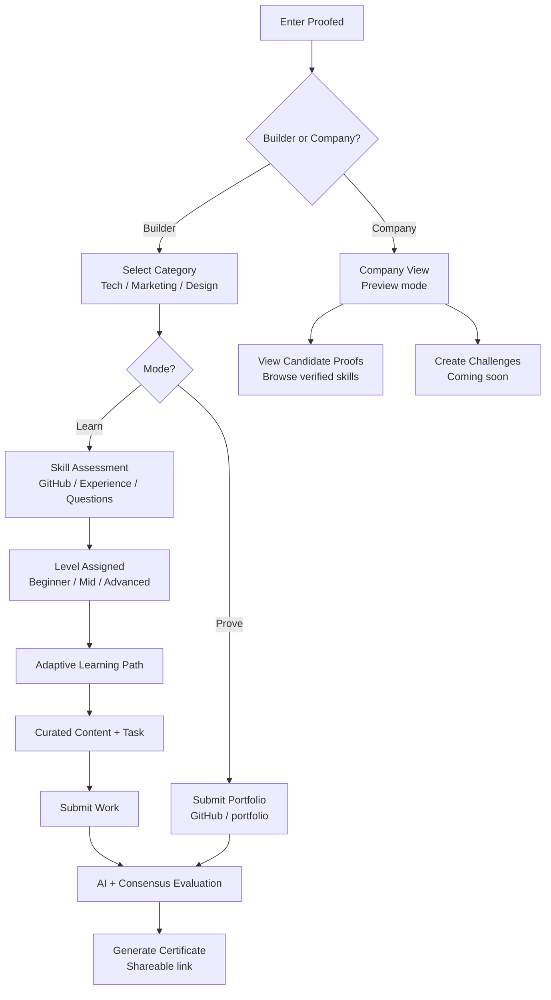

# ⬡ Proofed Protocol

> The verification layer for the Web3 talent economy.
Product: https://proofed-aleph-uv26.vercel.app/ 
---

## The Problem

In the age of AI, knowledge is no longer a reliable signal. Anyone can generate code, content, or answers instantly — but we still lack a way to verify what someone can **actually build**.

Current systems rely on degrees, certificates, and resumes. But they don't reflect real capability.

> **There is no reliable way to prove real skills through real work.**
> This is not just a learning problem. It is a verification problem for the future of work.

Hundreds of thousands of people are trying to break into Web3. They find scattered YouTube videos, outdated tutorials, and courses that hand out certificates for watching content. That certificate doesn't prove they can build anything.

At the same time, AI can now write code. The question is no longer *"can you memorize syntax"* — it's *"can you actually build something real, understand what you built, and prove it."*

---

## The Numbers

| Stat | Data |
|---|---|
| Web3 developers active globally (2024) | ~25,000 |
| Projected Web3 market size by 2034 | $226 billion |
| CAGR of Web3 market | 48.2% |
| Developers who say certificates don't reflect real skill | 87% |
| Companies that struggle to verify candidate skills | 80% |
| Average online course completion rate | 5–15% |

The market needs hundreds of thousands of verified Web3 builders. The tools to verify them don't exist yet.

---

## Solution

Proofed introduces a **proof-of-skill layer**:

- Users complete or submit real work
- AI + decentralized consensus evaluate it
- Results become verifiable, on-chain credentials

Proofed Protocol is a coordination layer between real work, AI evaluation, decentralized validation, and on-chain proof. **Proof that you can actually build.**

---

## Key Differentiator

HackerRank tells you someone passed a test on their platform. Proofed tells the whole world — permanently, on-chain, trustlessly — that a person built something real and earned a score for it.

| | Traditional Platforms | Proofed |
|---|---|---|
| Credential type | Course completion | Real work output |
| Verifiability | Self-reported | On-chain, cryptographic |
| Tamper-proof | No | Yes |
| Economic incentive | None | Score-proportional rewards |

---

## How It Works


## Live Evaluation Example

The AI evaluator reads real source code — not just the README. Here's an example output when evaluating the Proofed repo itself:

**Strengths identified:**
- `contracts/proofed.py` defines a real GenLayer smart contract with meaningful on-chain state
- The `_evaluate` function uses `gl.nondet.web.render` to fetch GitHub repo content and constructs a structured AI prompt for rubric-based scoring
- `src/lib/genlayer/client.ts` exists and is referenced by `Screen1Category.tsx`, indicating client-side integration with the deployed contract

**Improvements flagged:**
- `contracts/proofed.py` is truncated — critical contract methods like `submit()`, `claim_reward()`, and payout logic are missing
- `src/app/api/evaluate/route.ts` uses `Math.random()` to generate validator scores — the on-chain GenLayer contract evaluation path is not fully wired end-to-end
- `src/app/api/verify/route.ts` returns hardcoded scores — on-chain verification is simulated, not real

> The system is transparent enough to critique its own incomplete parts — no black box.


### Builder — Learn Mode
- System evaluates your current level
- Gives you a personalized learning path
- You complete real tasks
- You receive on-chain proof of your skill

### Builder — Prove Mode
> Designed for users who already have skills and need validation (e.g. job applications)

- Skip the learning path
- Submit your existing work (GitHub / portfolio)
- Get evaluated immediately
- Receive proof on-chain

### Company (Preview)
Companies can:
- Review candidates through verified proof of work
- Access real performance data instead of resumes

**Coming soon:** create custom challenges and evaluate candidates directly through Proofed.

---

## Value Proposition

**1. Personalized learning path based on your goals**
You define what you want to learn and prove. The AI builds a curated path — structured resources in the right order, matched to your track and level.

**2. A community where real progress is measured**
Progress isn't self-reported. It's verified. Every completion, every score, every proof is on-chain — visible, comparable, and real.

**3. On-chain validation of tasks and projects**
When you complete a task, the result is evaluated by AI, validated by decentralized consensus, and stored permanently on Avalanche. Anyone can verify it. No one can fake it.

**4. Gamification centered on real learning**
Reward pools incentivize genuine effort — not just finishing. Rewards are distributed proportionally by score. The better you build, the more you earn.

---

## Evaluation Rubric

Every submission is scored against the same transparent rubric — visible to the user before they start. No black box.

| Criteria | Weight |
|---|---|
| Task requirements met | 40% |
| Code structure & cleanliness | 30% |
| Responsiveness / correctness | 20% |
| Bonus polish | 10% |

---

## Reward Pool

Organizations or users fund skill bounties. Participants optionally enter ($2 or $5 USDC). Rewards are distributed proportionally by score — the better you build, the more you earn.

```js
const total = scores.reduce((a, b) => a + b, 0);
const rewards = scores.map(score => (score / total) * pool);
```

This creates real economic incentive to do genuine work — not just finish a course.

---

## Available Tracks (MVP)

**Tech** ✅ Active
- Smart Contracts — Solidity · EVM · Deployment
- Web3 Frontend — React · ethers.js · Wagmi
- Web3 Backend — Node · APIs · Indexing

**Marketing** — Coming soon

**Design** — Coming soon

---

## Tech Stack

| Layer | Technology | Role |
|---|---|---|
| AI Agent | Claude API (Anthropic) | Learning path curation, rubric evaluation, structured feedback |
| Decentralized Validation | GenLayer · Bradbury Testnet | 3-validator consensus, Optimistic Democracy, Equivalence Principle |
| Frontend | Next.js 14 · Tailwind CSS | Full product flow, leaderboard, public verification page |
| Reward Logic | TypeScript | Proportional score-based pool distribution |

API Repository: [Proofed_API](https://github.com/mauroradino/Proofed_API) · Live: [proofed-api.vercel.app](https://proofed-api.vercel.app)

---

## Business Model

### Revenue Streams

| Stream | Pricing | Type | Potential |
|---|---|---|---|
| Sponsored Bounties | 10–15% fee on pool | B2B | Core engine at scale |
| Entry-Based Pools | $2–$5 cut per entry | B2C | Recurring user engagement |
| Verification API | $99–$499/mo subscription | B2B | High-margin hiring layer |
| Premium Evaluation | Per-use or subscription | B2B + B2C | Upsell on engaged users |
| Paid Certificates | $59 (Beginner/Mid) · $79 (Advanced) | B2C | High-margin, scalable |
| Company Challenges | TBD | B2B | Talent pipeline play |

### Unit Economics

> 10% fee × $1,000 pool × 100 active bounties/month = **$10,000 MRR from fees alone** — before any B2B or certificate revenue.

### Certificate Pricing

| Level | Price | Benchmark |
|---|---|---|
| Beginner / Mid | $59 | Comparable to Coursera / LinkedIn |
| Advanced | $79 | Premium tier — higher resume value |

---

## Hackathon

- Submitted to the **Crecimiento Track** in [PL_Genesis Hackathon](https://devspot.app/projects/1510)
- AI + crypto with strong real-world use case
- Scalable infrastructure for the Web3 talent economy

---

## Getting Started

```bash
git clone https://github.com/Proofed-skill-protocol/Proofed-Aleph-
cd Proofed-Aleph-
npm install
cp .env.example .env.local
npm run dev
```

Open [http://localhost:3000](http://localhost:3000)

```bash
# .env.local
ANTHROPIC_API_KEY=sk-ant-...
```

> Without an API key the app runs in simulated mode with realistic pre-set results.

---

## Vision

A world where:
- Skills are proven through real work
- Credentials are verifiable by anyone
- Opportunities are based on what you can build — not what you claim

---

## Feedback & Collaboration

Open to feedback, ideas, and collaborations.

[General track submission](https://devspot.app/projects/1510)
